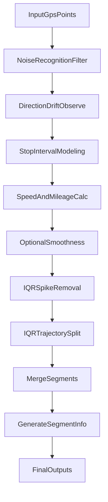

# GpsPathTransfigure

面向设备上报 GPS 轨迹的优化与结构化建模库。内置**停留点时空建模（区间检测 + 密度聚类 DBSCAN）**、**鲁棒统计异常检测（IQR）**与**轨迹分段**等算法链路，用于把原始轨迹点转成可直接用于地图渲染、停留分析、轨迹回放和统计计算的结果数据。

## 适用场景

- 轨迹回放：外勤、物流、巡检、车辆历史轨迹回放。
- 停留分析：停留点识别、停留时长统计、驻留行为分析。
- 质量增强：抖动过滤、异常跳点处理、轨迹切段与拼接。
- 业务建模：按运动段/停留段输出结构化 `segmentInfo`，可直接用于报表和明细卡片。

## 使用前提与输入要求

- 输入点位字段建议为：`[{ lng, lat, currentTime }]`。
- 时间字段必须可被 `moment` 按 `timeformat` 正确解析（默认 `YYYY-MM-DD HH:mm:ss`）。
- 点位应按时间升序传入，避免无序数据影响停留建模与速度计算。
- 建议至少提供 10 个以上点位，过短轨迹不利于稳定识别。
- 如果启用 `smoothness`，需配置 `aMapKey` 或 `gMapKey`，并评估地图 API 成本。

## 插件使用

### 安装

```shell
npm install gpspathtransfigure
```

### 引用

```javascript
import GpsPathTransfigure from "gpspathtransfigure"
```

### 快速开始（最小闭环）

```javascript
import GpsPathTransfigure from "gpspathtransfigure";

GpsPathTransfigure.conf({
  locale: "zh",
  openDebug: false,
  pathColorOptimize: true,
});

const result = await GpsPathTransfigure.optimize(gpsPoints);
const { finalPoints, trajectoryPoints, stopPoints, segmentInfo } = result;
```

#### 输出如何落图

- `finalPoints`：适合直接画主轨迹线（已完成停留建模和异常处理）。
- `trajectoryPoints`：适合按速度颜色渐变渲染轨迹。
- `stopPoints`：适合做停留标注、停留卡片、停留时长展示。
- `segmentInfo`：适合做“运动段/停留段”时间轴与明细列表。

## 效果预览（重点）

### A. 静止 + 高频抖动（3 组样本）

> 目标：在静止场景中抑制高频漂移，稳定识别停留段，减少“原地乱跳”。


### B. 行驶 + 少量抖动（3 组样本）

> 目标：在行驶轨迹中保留运动形态，减少轻微抖动对轨迹平滑性和里程统计的干扰。


## 核心功能特性

- 停留点时空建模：基于**方向漂移特征**识别停留候选区间，并通过**时长阈值 + 区间合并（距离/时间间隔）**稳定停留段。
- 时空聚类二次判定：对停留候选区间做**密度聚类（DBSCAN）**与密度评分，释放低密度误判区间（更抗抖动/漂移）。
- 轨迹鲁棒降噪：包含原始噪声过滤、**IQR（四分位距）**异常跳点识别与处理（剔除毛刺/降低里程失真）。
- 轨迹分段：输出 `motion/stopped` 结构化分段，支持业务端直接消费。
- 渲染增强：支持按速度分级着色轨迹输出，提升回放可读性。
- 轨迹补偿：可选调用地图服务做轨迹补点（`smoothness`）。
- 统计指标：输出 `avgSpeed`、`moveAvgSpeed`、`totalMileage`、`trajectoryMileage`。

## 算法与建模流程

`optimize` 的主流程为：噪声过滤 -> 停留区间观测 -> 停留替换建模 -> 里程速度计算 -> 可选补偿 -> 异常剔除/切段 -> 轨迹拼接 -> 分段输出。



### 关键建模说明

- 停留识别主参考：`observeStopPointDirectionDrift` 的 `mergedDriftIntervals`（基于相邻向量夹角、窗口特征与阈值策略形成区间）。
- 时空约束的停留建模：区间会应用**最小时长（分钟级）**约束，并支持按**空间距离阈值 + 时间间隔阈值**做区间合并，减少断断续续的停留碎片。
- 停留点输出形式：停留区间点集会被替换为一个**地理质心（centroid）**点，并携带 `startPosition/endPosition/startTime/endTime/stopTimeSeconds` 等停留语义字段。
- 密度聚类二次判定：对每个候选区间内的点做 **DBSCAN** 并计算密度分数，低于阈值则释放为普通点（避免把“漂移但不集中”的点误判为停留）。
- 异常毛刺处理：通过 **IQR** 检测极端跳点，执行剔除或切段，降低里程与速度的系统性偏差。

## 配置参数（按代码实现整理）

### 1) 基础与格式化

| 参数 | 类型 | 默认值 | 说明 |
| -- | -- | -- | -- |
| `distanceThreshold` | `Number` | `35` | 距离阈值（米） |
| `format` | `Boolean` | `true` | 是否格式化里程/时间文案 |
| `locale` | `String` | `zh` | 国际化语言 |
| `timeformat` | `String` | `YYYY-MM-DD HH:mm:ss` | 时间解析格式 |
| `mapWidth` | `Number` | `1024` | 地图宽度（用于计算 zoom） |
| `mapHeight` | `Number` | `768` | 地图高度（用于计算 zoom） |
| `defaultZoom` | `Number` | `16` | zoom 回退值 |
| `useUniApp` | `Boolean` | `false` | 是否使用 uniapp 请求方式 |
| `openDebug` | `Boolean` | `false` | 是否输出调试日志 |

### 2) 异常识别与统计

| 参数 | 类型 | 默认值 | 说明 |
| -- | -- | -- | -- |
| `abnormalPointRatio` | `Number` | `0.05` | 异常点占比阈值，超过时判定异常识别不适用 |
| `IQRThreshold` | `Number` | `2.5` | 里程异常 IQR 阈值 |
| `speedIQRThreshold` | `Number` | `0.75` | 速度异常 IQR 阈值 |
| `limitSpeed` | `Number` | `150` | 速度上限（km/h） |
| `proximityStopThreshold` | `Number` | `45` | 近距离停留阈值（米） |
| `proximityStopTimeInterval` | `Number` | `60` | 近距离停留时间阈值（分钟） |
| `proximityStopMerge` | `Boolean` | `true` | 近距离停留点合并（兼容保留） |

### 3) 轨迹补偿（可选）

| 参数 | 类型 | 默认值 | 说明 |
| -- | -- | -- | -- |
| `smoothness` | `Boolean` | `false` | 是否启用轨迹补偿 |
| `smoothnessAvgThreshold` | `Number` | `1.6` | 点距超过均值倍数时触发补偿候选 |
| `smoothnessLimitAvgSpeed` | `Number` | `40` | 启用补偿的平均速度上限（km/h） |
| `aMapKey` | `String` | `''` | 高德地图 key |
| `gMapKey` | `String` | `''` | Google 地图 key |
| `defaultMapService` | `String` | `''` | 强制地图服务：`amap` / `gmap` |

### 4) 轨迹渲染

| 参数 | 类型 | 默认值 | 说明 |
| -- | -- | -- | -- |
| `pathColorOptimize` | `Boolean` | `true` | 是否开启按速度着色 |
| `speedColors` | `Array` | 24 级颜色数组 | 速度由慢到快的色阶 |
| `samplePointsNum` | `Number` | `200` | 输出抽样点数量上限 |

### 5) 漂移观测（停留建模核心参数）

| 参数 | 默认值 | 含义 |
| -- | -- | -- |
| `driftObserveWindowSize` | `31` | 漂移观测窗口大小 |
| `driftObserveStartStreak` / `driftObserveEndStreak` | `5` / `5` | 进入/退出区间连续命中点数 |
| `driftObserveHighQuantile` / `driftObserveLowQuantile` | `0.65` / `0.35` | 分位阈值 |
| `driftObserveBandRatioMin` / `driftObserveSpreadMin` | `0.35` / `0.35` | 分布退化判据 |
| `driftObserveAbsHighScore` | `1.2` | 高分绝对线 |
| `driftObserveAbsMedianScoreMin` | `0.7` | 中位数门控 |
| `driftObserveHighScoreRatioTrigger` | `0.4` | 高分占比门控 |
| `driftObserveMinFallbackSampleSize` | `30` | fallback 最小样本保护 |
| `driftObserveAbsAngleHigh` / `driftObserveAbsAngleLow` | `60` / `35` | 固定角度 fallback 阈值 |
| `driftObserveMergeDistanceThresholdMeters` | `55` | 区间合并距离阈值（米） |
| `driftObserveMergeGapMaxMinutes` | `45` | 区间合并时间间隔阈值（分钟） |
| `driftObserveMinStopDurationMinutes` | `30` | 最短停留时长阈值（分钟） |
| `driftObserveDensityEpsMeters` / `driftObserveDensityMinPts` | `50` / `5` | DBSCAN 核心参数 |
| `driftObserveDensitySampleTriggerCount` | `100` | 密度观测触发采样阈值 |
| `driftObserveDensityMaxPoints` | `200` | 密度观测最大点数 |
| `driftObserveDensityScoreThreshold` | `0.6` | 密度分数释放阈值 |

### 兼容保留参数（旧逻辑，不建议新项目依赖）

`minComparisonPoints`、`distanceThresholdPercentage`、`stationaryEndPoints`、`limitStopPointTime`、`autoOptimize`、`autoOptimizeMaxCount`。

---

## 使用案例(Vue3)

``` javascript
<script setup>
  import { onMounted } from "vue";
  import GpsPathTransfigure from "gpspathtransfigure"
......

onMounted(async ()=>{
    var gpsPoint =[
    ......
    {lon: 14.3908478, lat: 38.3038816, currentTime: '2024-06-27 01:43:36'},
    {lon: 114.3908478, lat: 38.3038816, currentTime: '2024-06-27 01:46:35'},
    {lon: 114.3906792, lat: 38.3037608, currentTime: '2024-06-27 01:47:50'},
    {lon: 114.3906634, lat: 38.3037528, currentTime: '2024-06-27 01:47:55'},
    ......
    ]

    GpsPathTransfigure.conf({
      locale:'zh',
      aMapKey:webApiKey,
      defaultMapService:'amap',
      openDebug:false,
      pathColorOptimize:true,
      samplePointsNum:300
    })

  const staticPoints = await GpsPathTransfigure.optimize(pathParam);
    const { finalPoints, stopPoints,trajectoryPoints, center, zoom ,segmentInfo,startPoint,endPoint,samplePoints} = staticPoints;

    ......
}
......
</script>
```

请注意，在使用此插件时需要异步引用。代码中直接使用finalPoints渲染轨迹即可。若想要渲染停留点标注效果，则渲染所有的stopPoints。渲染带颜色的轨迹请使用trajectoryPoints渲染。高德地图和Google地图的渲染案例请查阅Amap.vue/Gmap.vue源码

## 进度条使用方法

``` javascript
<template>
......
<ProgressChart :locale="locale" :data="playPoints" :onMove="handleMove" :setPosition="playPosition" sliderImage="data:image/png;base64,iVBORw0KGgoAAAANSUhEUgAAADAAAAAwCAYAAABXAvmHAAAAAXNSR0IArs4c6QAAASBJREFUaEPtltENgkAQRO/q0H6oRNsQ29BK6EfrwGBi4gey9zIsCXH85bG3s7NyU8vOf3Xn/RcLOJ6HfhzLZXKy1nJ93Lp+yVXKRxsiOfDdzOegJRGUj5p/D60F+sUcTsM49+x572brUr6lt/8WQFeC8ukOTAfQPyXlIxHSCkXFt3huAVtMeekMO2AHxAnIK0Q/i5SP9EkC6MVE+ah5ZyEaziif7gBdCcqnC3AWahlxwEhfoRXOl0tYgDxCsYAdEAcovy47QLMN5SOFkgB6MVE+at5ZiGYbyqc7QFeC8ukCnIVaRuwstMKUMktI90BmY621LaB1Ulmc7ADNNpSPhEsC6MVE+ah5ZyGabSif7gBdCcqnC3AWahmxs9AKU8os8QK/SiBAyMIBIAAAAABJRU5ErkJggg==" />
......
</template>
<script setup>
import ProgressChart from 'gpspathtransfigure/src/component/ProgressChart.vue';

  //国际化语言 en/zh(default)
  let locale = 'en'
  //用于可播放的轨迹点
  let playPoints = []
  //播放位置。这里是轨迹点的下标。修改后可反响控制进度条进度
  let playPosition = ref(0)

  /**
   * 拖动进度条时的回调。
   * @param {*} index 轨迹下标
   */
  const handleMove = (index) => {
  //在这里处理回调。index是轨迹数据下标
  };

</script>
```

项目中Amap.vue有完整的使用案例

## 返回值说明

| 字段 | 含义 | 主要用途 |
| -- | -- | -- |
| `turnAngleSeries` | 角度漂移观测序列（调参与分析用） | 停留识别调试 |
| `finalPoints` | 优化后的轨迹主点集（包含停留建模结果） | 主轨迹渲染 |
| `trajectoryPoints` | 按速度拆分后的着色轨迹片段 | 渐变轨迹渲染 |
| `stopPoints` | 停留点集合（含起止时间与停留时长） | 停留标注、停留统计 |
| `center` | 轨迹中心点 | 地图初始化 |
| `zoom` | 自动计算的缩放级别 | 地图初始化 |
| `segmentInfo` | 运动段/停留段结构化信息 | 行程卡片、明细报表 |
| `startPoint` / `endPoint` | 轨迹起终点 | 起终点标注 |
| `samplePoints` | 固定数量抽样点 | 轨迹预览/缩略图 |
| `avgSpeed` | 全时段平均速度（含停留） | 总览统计 |
| `moveAvgSpeed` | 仅运动段平均速度 | 运动效率分析 |
| `totalMileage` | 总里程（含补点/虚线连接影响） | 总览统计 |
| `trajectoryMileage` | 真实轨迹里程（不含虚线连接） | 真实里程统计 |

## 调试与可视化说明

### debuggingMode.png：停留点建模调试示意


该图用于解释停留点建模过程中的观测信号与区间判断逻辑，适合配合 `openDebug: true` 排查停留误判或漏判。

### trajectorySegmentation.png：轨迹分段示意


该图用于展示轨迹被分解为 `motion` 与 `stopped` 段后的结构化结果，可用于时间轴、分段卡片和行为分析视图。

## 调参建议（按场景）

- 静止抖动明显：优先关注 `driftObserveWindowSize`、`driftObserveAbsAngleHigh/Low`、`driftObserveDensityScoreThreshold`。
- 行驶为主且抖动轻微：保持默认漂移参数，重点调整 `IQRThreshold` 与 `pathColorOptimize`。
- 存在长距离跳点：适当降低 `IQRThreshold`，观察切段结果与 `trajectoryMileage` 变化。
- 需要轨迹更平滑：开启 `smoothness`，并配合 `smoothnessLimitAvgSpeed` 控制误补点风险。

## 问题反馈

- GitHub issues: [https://github.com/Observe-secretly/GpsPathTransfigure/issues](https://github.com/Observe-secretly/GpsPathTransfigure/issues)
